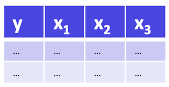
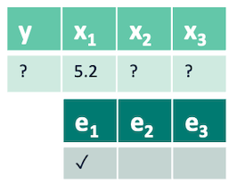
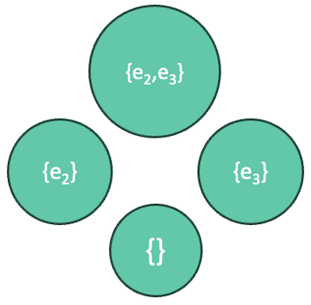
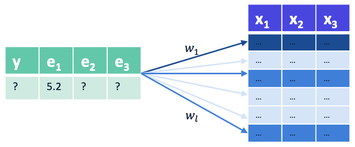
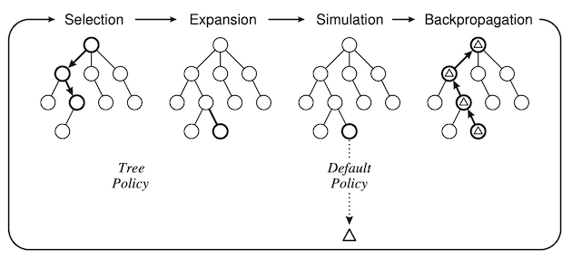
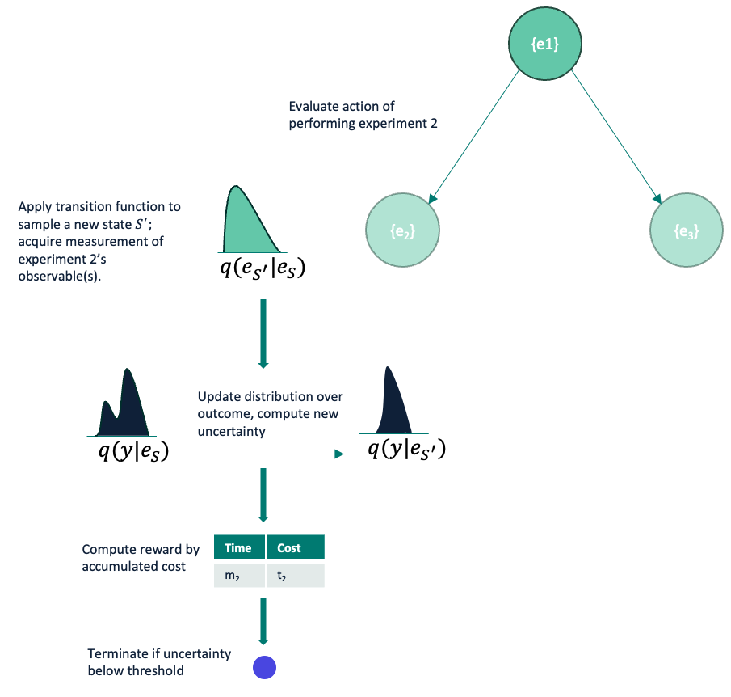

```@meta
EditURL = "SimpleGenerative.jl"
```

# [Generative Experimental Designs](@id simple_generative)

This document describes the theoretical background behind tools in CEEDesigns.jl for generative experimental designs
and demonstrates uses on synthetic data examples.

## Setting

Generative experimental designs differ from static designs in that the experimental design is specific for (or "personalized") to an incoming entity.
Personalized cost-efficient experimental designs for the new entity are made based on existing information (if any) about the new entity,
and from posterior distributions of unobserved features of that entity conditional on its observed features and historical data.
The entities may be patients, molecular compounds, or any other objects where one has a store of historical data
and seeks to find efficient experimental designs to learn more about a new arrival.

The personalized experimental designs are motivated by the fact that the value of information collected from an experiment
often differs across subsets of the population of entities.


In the context of static designs, we do not aspire to capture variation in information gain across different entities. Instead, we assume all entities come from a "Population" with a uniform information gain, in which case "Experiment C" would provide the maximum information value.
On the other hand, if we have the ability to discern if the entity belong to subpopulations "Population 1" or "Population 2," then we can tailor our
design to suggest either "Experiment A" or "Experiment B." Clearly, in the limit of a maximally heterogenous population, each
entity has its own "row." Our tools are able to handle the entire spectrum of such scenarios though distance based similarity,
described below.

## Theoretical Framework

### Historical Data

Like static designs, we consider a set $E$ of $n$ experiments, each with an associated tuple $(m_{e},t_{e})$ of monetary and
time costs (for more details on experiments and arrangements, see the tutorial on [static experimental designs](@ref simple_static)).

Additionally, consider a historical dataset giving measurements on $m$ features $X = \{x_1, \ldots, x_m\}$ for $l$ entities
(with entities and features representing rows and columns, respectively). Each experiment $e$ may yield measurements on some
subset of features $(X_{e}\subseteq X)$.

Furthermore there is an additional column $y$ which is a target variable we want to predict (CEEDesigns.jl may allow $y$
to be a vector, but we assume it is scalar here for ease of presentation).

Letting $m=3$, then the historical dataset may be visualized as the following table:



### New Entity

When a new entity arrives, it will have an unknown outcome $y$ and unknown values of some or all features $x_{i} \in X$.
We call the _state_ of the new entity the set of experiments conducted upon it so far (if any), along with the
measurements on any features produced by those experiments (if any), called _evidence_.

Consider the case where there are $n=3$ experiments, each of which yields a measurement on a single feature. Then
the state of a new entity arriving for which $e_{1}$ has already been performed will look like:



Letting $S$ denote the set of experiments which have been performed so far, then $S^{\prime}=E\S$ are unperformed experiments.
Then, _actions_ one can perform to learn more about the new entity are subsets of $S^{\prime}$. The size of subsets
is limited by the maximum number of parallel experiments.

In our running example, if the maximum number of parallel experiments is at least 2, then the available actions are:



### Posterior Distributions

Let $e_{S}$ be a random variable denoting the outcome of some experiments $S$ on the new entity. Then, there exists a
posterior distribution $q(e_{S^{\prime}}|e_{S})$ over outcomes of unperformed experiments $S^{\prime}$, conditioned on the current
state.

Furthermore, there also exists a posterior distribution over the unobserved target variable $q(y|e_{S})$. The information
value of the current state, derived from experimental evidence, can be defined as any statistical or information-theoretic
measure applied to $q(y|e_{S})$. This can include variance or entropy (among others). The information value
of the set of experiments performed in $S$ is analogous to $v_{S}$ defined in [static experimental designs](SimpleStatic.md).

### Similarity Weighting

There may be many ways to define these posterior distributions, but our approach uses distance-based similarity
scores to construct weights $w_{j}$ over historical entities which are similar to the new entity. These weights can be used to
weight the values of $y$ or features associated with $e_{S^{\prime}}$ to construct approximations of $q(y|e_{S})$ and
$q(e_{S^{\prime}}|e_{S})$.

If there is no evidence associated with a new entity, we assign $w_{j}$ according to some prior distribution (uniform by default).
Otherwise we use some particular distance and similarity metrics.

For each feature $x\in X$, we consider a function $\rho_x$, which measures the distance between two outputs. Please be aware that the "distances" discussed here do not conform to the mathematical definition of "metrics", even though they are functions derived from underlying metrics (i.e., a square of a metric). This is justified when considering how these "distances" are subsequently converted into probabilistic weights.

By default, we consider the following distances:
- Rescaled Kronecker delta (i.e., $\rho(x, y)=0$ only when $x=y$, and $\rho(x, y)= \lambda$ under any other circumstances, with $\lambda > 0$) for discrete features (i.e., features whose types are modeled as `MultiClass` type in [ScientificTypes.jl](https://github.com/JuliaAI/ScientificTypes.jl));
- Rescaled ("standardized", by default) squared distance $\rho(x, y) = λ \frac{(x - y)^2}{\sigma^2}$, where $\sigma^2$ is the variance of the feature column, estimated with respect to the prior for continuous features.
- Squared Mahalanobis distance $\rho(x,y) = (x-y)^{⊤}\Sigma^{-1}(x-y)$, where $\Sigma$ is the empirical covariance matrix of the historical data.

For distance metrics assuming independence of features (Kronecker delta and squared distance), given the new entity's experimental state with readouts over the feature set $F = \bigcup X_{e}$, where $e \in S$, we can calculate
the distance from the $j$-th historical entity as $d_j = \sum_{x\in F} \rho_x (\hat x, x_j)$, where $\hat x$ and $x_j$ denote the readout
for feature $x$ for the entity being tested and the entity recorded in $j$-th column.
The squared Mahalanobis distance directly takes in "rows", $\rho(\hat{x},x_{j})$.

Next, we convert distances $d_j$ into probabilistic weights $w_j$. By default, we use a rescaled exponential function, i.e.,
we put $w_j = \exp(-\lambda d_j)$ with $\lambda=0.5$. Notably, $\lambda$'s value determines how belief is distributed across the historical entities.
Larger values of $\lambda$ concentrate the belief tightly around the "closest" historical entities, while smaller values distribute more belief to more distant entities.

Note that by choosing the squared Mahalanobis distance and the exponential function with a factor of $\lambda=0.5$, the resulting weight effectively equals the density of a [multivariate normal distribution](https://en.wikipedia.org/wiki/Multivariate_normal_distribution#Density_function) fitted to the historical data. A similar assertion applies when we use the sum of "standardized" squared distances instead. However, in this latter case, we "enforce" the independence of the features.

The proper choice of distance and similarity metrics depends on insight into the dataset at hand. Weights can then be used to construct
weighted histograms or density estimators for the posterior distributions of interest, or to directly resample historical rows.



### Policy Search

Given these parts, searching for optimal experimental designs (actions arranged in an efficient way) depends on what our objective sense is.

- The search may continue until the uncertainty about the posterior distribution of the target variable falls below a certain level. Our aim is to minimize the anticipated combined monetary cost and execution time of the search (considered as a "negative" reward). If all experiments are conducted without reaching below the required uncertainty level, or if the maximum number of experiments is exceeded, we penalize this scenario with an "infinitely negative" reward.
- We may aim to minimize the expected uncertainty while being constrained by the combined costs of the experiment.
- Alternatively, we could maximize the value of experimental evidence, adjusted for the incurred experimental costs.

Standard Markov decision process (MDP) algorithms can be used to solve this problem (offline learning) or construct the policy (online learning) for the sequential decision-making.

Our MDP's state space is finite-dimensional but generally continuous due to the allowance of continuous features, which complicates the problem and few algorithms specialize in this area.

We used the Double Progressive Widening Algorithm for this task as detailed in [A Comparison of Monte Carlo Tree Search and Mathematical Optimization for Large Scale Dynamic Resource Allocation](https://arxiv.org/abs/1405.5498).

In a nutshell, the Double Progressive Widening (DPW) algorithm is designed for online learning in complex environments, particularly those known as Continuous Finite-dimensional Markov Decision Processes where the state space is continuous. The key idea behind DPW is to progressively expand the search tree during the Monte Carlo Tree Search (MCTS) process. The algorithm does so by dynamically and selectively adding states and actions to the tree based on defined heuristics.

In the context of online learning, this algorithm addresses the complexity and challenges of real-time decision-making in domains with a large or infinite number of potential actions. As information is gathered in actual runtime, the algorithm explores and exploits this information to make optimal or near-optimal decisions. In other words, DPW permits the learning process to adapt on-the-fly as more data is made available, making it an effective tool for the dynamic and uncertain nature of online environments.

In particular, at the core of the Double Progressive Widening (DPW) algorithm are several key components, including expansion, search, and rollout.

The search component is where the algorithm sifts through the search tree to determine the most promising actions or states to explore next. By using exploration-exploitation strategies, it can effectively balance its efforts between investigating previously successful actions and venturing into unexplored territories.

The expansion phase is where the algorithm grows the search tree by adding new nodes, representing new state-action pairs, to the tree. This is done based on a predefined rule that dictates when and how much the tree should be expanded. This allows the algorithm to methodically discover and consider new potential actions without becoming overwhelmed with choices.

Lastly, the rollout stage, also known as a simulation stage, is where the algorithm plays out a series of actions to the end of a game or scenario using a specific policy (like a random policy). The results of these rollouts are then used to update the estimates of the values of state-action pairs, increasing the accuracy of future decisions.



In the above figure, nodes represent states of the decision process, while edges correspond to actions connecting these states.

A graphical summary of a single step of the overall search process to find the next best action, using our running example where a new entity
has had $e_{1}$ performed out of 3 possible experiments is below:



## Synthetic Data Example with Continuous $y$

We now present an example of finding cost-efficient generative designs on synthetic data using the CEEDesigns.jl package.

First we load necessary packages.

````@example SimpleGenerative
using CEEDesigns, CEEDesigns.GenerativeDesigns
using DataFrames
using ScientificTypes
import Distributions
using Copulas
using POMDPs, POMDPTools, MCTS
using Plots, StatsPlots, StatsBase
````

### Synthetic Data

We use the "Friedman #3" method to make synthetic data for a regression problem from [scikit-learn](https://scikit-learn.org/stable/datasets/sample_generators.html#generators-for-regression).
It considers $m=4$ features which predict a continuous $y$ via some nonlinear transformations. The marginal
distributions of each feature are given by the scikit-learn documentation. We additionally use a Gaussian copula
to induce a specified correlation structure on the features to illustrate the difference between Euclidean and Mahalanobis
distance metrics. We sample $l=1000$ rows of the historical data.

````@example SimpleGenerative
make_friedman3 = function (U, noise = 0, friedman3 = true)
    size(U, 2) == 4 || error("input U must have 4 columns, has $(size(U,2))")
    n = size(U, 1)
    X = DataFrame(zeros(Float64, n, 4), :auto)
    for i = 1:4
        X[:, i] .= U[:, i]
    end
    ϵ = noise > 0 ? rand(Distributions.Normal(0, noise), size(X, 1)) : 0
    if friedman3
        X.y = @. atan((X[:, 2] * X[:, 3] - 1 / (X[:, 2] * X[:, 4])) / X[:, 1]) + ϵ
    else
        # Friedman #2
        X.y = @. (X[:, 1]^2 + (X[:, 2] * X[:, 3] - 1 / (X[:, 2] * X[:, 4]))^2)^0.5 + ϵ
    end
    return X
end

ρ12, ρ13, ρ14, ρ23, ρ24, ρ34 = 0.8, 0.5, 0.3, 0.5, 0.25, 0.4
Σ = [
    1 ρ12 ρ13 ρ14
    ρ12 1 ρ23 ρ24
    ρ13 ρ23 1 ρ34
    ρ14 ρ24 ρ34 1
]

X1 = Distributions.Uniform(0, 100)
X2 = Distributions.Uniform(40 * π, 560 * π)
X3 = Distributions.Uniform(0, 1)
X4 = Distributions.Uniform(1, 11)

C = GaussianCopula(Σ)
D = SklarDist(C, (X1, X2, X3, X4))

X = rand(D, 1000)

data = make_friedman3(transpose(X), 0.01)

data[1:10, :]
````

We can check that the empirical correlation is roughly the same as the specified theoretical values:

````@example SimpleGenerative
cor(Matrix(data[:, Not(:y)]))
````

We ensure that our algorithms know that we have provided data of specified types.

````@example SimpleGenerative
types = Dict(
    :x1 => ScientificTypes.Continuous,
    :x2 => ScientificTypes.Continuous,
    :x3 => ScientificTypes.Continuous,
    :x4 => ScientificTypes.Continuous,
    :y => ScientificTypes.Continuous,
)
data = coerce(data, types);
nothing #hide
````

We may plot each feature $x_{i} \in X = {x_{1},x_{2},x_{3},x_{4}}$ against $y$.

````@example SimpleGenerative
p1 = scatter(data.x1, data.y; legend = false, xlab = "x1")
p2 = scatter(data.x2, data.y; legend = false, xlab = "x2")
p3 = scatter(data.x3, data.y; legend = false, xlab = "x3")
p4 = scatter(data.x4, data.y; legend = false, xlab = "x4")
plot(p1, p2, p3, p4; layout = (2, 2), legend = false)
````

### Distance-based Similarity

Given historical data, a target variable $y$, and metric to quantify uncertainty around
the posterior distribution on the target $q(y|e_{S})$, the function `DistanceBased`
returns three functions needed by CEEDesigns.jl:
- `sampler`: this is a function of `(evidence, features, rng)`, in which `evidence` denotes the current experimental evidence, `features` represent the set of features we want to sample from, and `rng` is a random number generator;
- `uncertainty`: this is a function of `evidence`,
- `weights`: this represents a function of `evidence` that generates probability weights $w_j$ to each row in the historical data.

By default, Euclidean distance is used as the distance metric. In the second
call to `DistanceBased`, we instead use the squared Mahalanobis distance.
It is possible to specify different distance metrics for each feature, see our
[heart disease generative modeling](GenerativeDesigns.md) tutorial for more information.
In both cases, the squared exponential function is used to convert distances
to weights.

````@example SimpleGenerative
(; sampler, uncertainty, weights) = DistanceBased(
    data;
    target = "y",
    uncertainty = Variance(),
    similarity = GenerativeDesigns.Exponential(; λ = 5),
);

(sampler_mh, uncertainty_mh, weights_mh) = DistanceBased(
    data;
    target = "y",
    uncertainty = Variance(),
    similarity = GenerativeDesigns.Exponential(; λ = 5),
    distance = SquaredMahalanobisDistance(; diagonal = 0),
);
nothing #hide
````

We can look at the uncertainty in $y$ for a state where a single
feature is "observed" at its mean value.
As we consider only a single non-missing entry, note that the probabilistic weights assigned by the squared Mahalanobis distance
are generally less "spread out." This is because the variant of the squared Mahalanobis distance, which we implemented for handling missing values,
effectively multiplies the other quadratic distance by a factor greater than one.
For more details, refer to page 285 of
[Multivariate outlier detection in incomplete survey data: The epidemic algorithm and transformed rank correlations](https://www.jstor.org/stable/3559861).
The interaction with uncertainties is more complex as the uncertainty depends on the values of the target variable that correspond to the rows in the historical data.

````@example SimpleGenerative
data_uncertainties =
    [i => uncertainty(Evidence(i => mean(data[:, i]))) for i in names(data)[1:4]]
sort!(data_uncertainties; by = x -> x[2], rev = true)

data_uncertainties_mh =
    [i => uncertainty_mh(Evidence(i => mean(data[:, i]))) for i in names(data)[1:4]]
sort!(data_uncertainties_mh; by = x -> x[2], rev = true)

p1 = sticks(
    eachindex(data_uncertainties),
    [i[2] for i in data_uncertainties];
    xformatter = i -> data_uncertainties[Int(i)][1],
    label = false,
    title = "Uncertainty\n(Euclidean distance)",
)
p2 = sticks(
    eachindex(data_uncertainties_mh),
    [i[2] for i in data_uncertainties_mh];
    xformatter = i -> data_uncertainties_mh[Int(i)][1],
    label = false,
    title = "Uncertainty\n(Mahalanobis distance)",
)

plot(p1, p2; layout = (1, 2), legend = false)
````

We can view the posterior distribution $q(y|e_{S})$ conditioned on a state (here arbitrarily set to $S = e_{3}$, giving evidence for $x_{3}$).

````@example SimpleGenerative
evidence = Evidence("x3" => mean(data.x3))
plot_weights = StatsBase.weights(weights(evidence))
plot_weights_mh = StatsBase.weights(weights_mh(evidence))

p1 = Plots.histogram(
    data.y;
    weights = plot_weights,
    legend = false,
    ylabel = "Density",
    title = "q(y|eₛ)\n(Euclidean distance)",
)
p2 = Plots.histogram(
    data.y;
    weights = plot_weights_mh,
    legend = false,
    ylabel = "Density",
    title = "q(y|eₛ)\n(Mahalanobis distance)",
)

plot(p1, p2; layout = (1, 2), legend = false)
````

Like static designs, generative designs need to be provided a `DataFrame` assigning to each experiment
a tuple of monetary and time costs $(m_{e},t_{e})$, and what features each experiment provides observations of.
We'll set up the experimental costs such that experiments which have less marginal uncertainty are more costly
We finally add a very expensive "final" experiment which can directly observe the target variable.

````@example SimpleGenerative
observables_experiments = Dict(["x$i" => "e$i" for i = 1:4])
experiments_costs = Dict([
    observables_experiments[e[1]] => (i, i) => [e[1]] for
    (i, e) in enumerate(data_uncertainties_mh)
])

experiments_costs["ey"] = (100, 100) => ["y"]

experiments_costs_df =
    DataFrame(; experiment = String[], time = Int[], cost = Int[], measurement = String[]);
push!(
    experiments_costs_df,
    [
        [
            e,
            experiments_costs[e][1][1],
            experiments_costs[e][1][2],
            only(experiments_costs[e][2]),
        ] for e in keys(experiments_costs)
    ]...,
);
experiments_costs_df
````

### Find Cost-efficient Experimental Designs

We can now find cost-efficient experimental designs for a new entity that has no measurements (`Evidence()`).
Our objective sense is to minimize expected experimental combined cost while trying to reduce uncertainty to
a threshold value. We examine 7 different threshold levels of uncertainty, evenly spaced between 0 and 1, inclusive.
Additionally we set the `costs_tradeoff` such that equal weight is given to time and monetary cost when
constructing the combined costs of experiments.

Internally, for each choice of the uncertainty threshold, an instance of a Markov decision problem in [POMDPs.jl](https://github.com/JuliaPOMDP/POMDPs.jl)
is created, and the `POMDPs.solve` is called on the problem.
Afterwards, a number of simulations of the decision-making problem is run, all starting with the experimental `state`.

Note that we use the Euclidean distance, due to somewhat faster runtime.

````@example SimpleGenerative
n_thresholds = 7
evidence = Evidence()
solver = GenerativeDesigns.DPWSolver(; n_iterations = 500, tree_in_info = true)
repetitions = 5
mdp_options = (;
    max_parallel = length(experiments_costs),
    discount = 1.0,
    costs_tradeoff = (0.5, 0.5),
)

designs = efficient_designs(
    experiments_costs;
    sampler = sampler,
    uncertainty = uncertainty,
    thresholds = n_thresholds,
    evidence = evidence,
    solver = solver,
    repetitions = repetitions,
    mdp_options = mdp_options,
);
nothing #hide
````

We plot the Pareto-efficient actions.

````@example SimpleGenerative
plot_front(designs; labels = make_labels(designs), ylabel = "% uncertainty")
````

## Synthetic Data Example with Discrete $y$

### Synthetic Data

We use n-class classification problem generator from [scikit-learn](https://scikit-learn.org/stable/modules/generated/sklearn.datasets.make_classification.html#sklearn.datasets.make_classification)
We used parameters given below, for a total of $m=5$ features, with 4 of those informative and 1 redundant (linear combination of the other 4) feature.
The $y$ has 2 classes, with some added noise. We again sample $l=1000$ rows of historical entities.

The dataset can be approximately reproduced as below:

````@example SimpleGenerative
# using PyCall
# sklearn = PyCall.pyimport_conda("sklearn", "scikit-learn")
# py"""
# import sklearn as sk
# from sklearn.datasets import make_classification
# """
# X, y = py"make_classification(n_samples=1000,n_features=5,n_informative=4,n_redundant=1,n_repeated=0,n_classes=2,n_clusters_per_class=2,flip_y=0.1)"
# using DataFrames, CSV
# dat = DataFrame(X, :auto)
# dat.y = y
# CSV.write("./class.csv",dat)

using CSV

data = CSV.read("./data/class.csv", DataFrame)

types = Dict(
    :x1 => ScientificTypes.Continuous,
    :x2 => ScientificTypes.Continuous,
    :x3 => ScientificTypes.Continuous,
    :x4 => ScientificTypes.Continuous,
    :y => ScientificTypes.Multiclass,
)
data = coerce(data, types);
nothing #hide
````

### Distance-based Similarity

We now set up the distance based similarity functions. We use `Entropy` as our metric of uncertainty this time,
which is more suitable for discrete $y$.

````@example SimpleGenerative
(; sampler, uncertainty, weights) = DistanceBased(
    data;
    target = "y",
    uncertainty = Entropy(),
    similarity = GenerativeDesigns.Exponential(; λ = 5),
);
nothing #hide
````

We may also look at the uncertainty from each marginal distribution of features.
This is a bit nonsensical as the data generating function will create multimodal clusters
so it will look artifically as if nothing is informative, but that is not the case.

````@example SimpleGenerative
data_uncertainties =
    [i => uncertainty(Evidence(i => mode(data[:, i]))) for i in names(data)[1:end-1]]
sort!(data_uncertainties; by = x -> x[2], rev = true)

sticks(
    eachindex(data_uncertainties),
    [i[2] for i in data_uncertainties];
    xformatter = i -> data_uncertainties[Int(i)][1],
    label = false,
    ylab = "Uncertainty",
)
````

We can view the posterior distribution $q(y|e_{S})$ when we consider the state as evidence a single measurement
of the first feature, set to the mean of that distribution.

````@example SimpleGenerative
evidence = Evidence("x1" => mean(data.x1))
plot_weights = StatsBase.weights(weights(evidence))

target_belief = countmap(data[!, "y"], plot_weights)
p = bar(
    0:1,
    [target_belief[0], target_belief[1]];
    xrot = 40,
    ylabel = "probability",
    title = "unc: $(round(uncertainty(evidence), digits=1))",
    kind = :bar,
    legend = false,
);
xticks!(p, 0:1, ["0", "1"]);
p
````

Like previous examples, we'll set up the experimental costs such that experiments which have less marginal uncertainty
are more costly, add a final very expensive experiment directly on the target variable.

````@example SimpleGenerative
observables_experiments = Dict(["x$i" => "e$i" for i = 1:5])
experiments_costs = Dict([
    observables_experiments[e[1]] => (i, i) => [e[1]] for
    (i, e) in enumerate(sort(data_uncertainties; by = x -> x[2], rev = true))
])

experiments_costs["ey"] = (100, 100) => ["y"]

experiments_costs_df =
    DataFrame(; experiment = String[], time = Int[], cost = Int[], measurement = String[]);
push!(
    experiments_costs_df,
    [
        [
            e,
            experiments_costs[e][1][1],
            experiments_costs[e][1][2],
            only(experiments_costs[e][2]),
        ] for e in keys(experiments_costs)
    ]...,
);
experiments_costs_df
````

### Find Cost-efficient Experimental Designs

We can now find sets of cost-efficient experimental designs for a new entity with no measurements (`Evidence()`).
We use the same solver parameters as for the exaple with continuous $y$, and plot the resulting
Pareto front.

````@example SimpleGenerative
n_thresholds = 7
evidence = Evidence()
solver = GenerativeDesigns.DPWSolver(; n_iterations = 500, tree_in_info = true)
repetitions = 5
mdp_options = (;
    max_parallel = length(experiments_costs),
    discount = 1.0,
    costs_tradeoff = (0.5, 0.5),
)

designs = efficient_designs(
    experiments_costs;
    sampler = sampler,
    uncertainty = uncertainty,
    thresholds = n_thresholds,
    evidence = evidence,
    solver = solver,
    repetitions = repetitions,
    mdp_options = mdp_options,
);

plot_front(designs; labels = make_labels(designs), ylabel = "% uncertainty")
````

